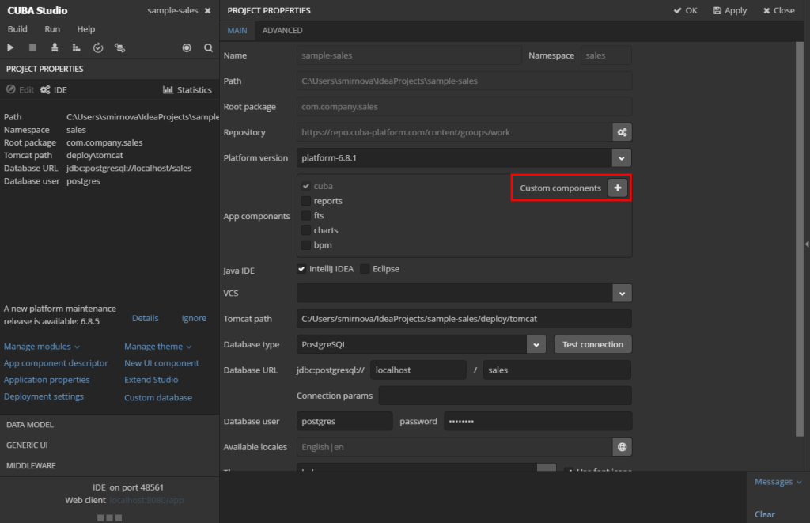
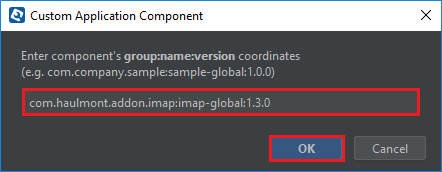
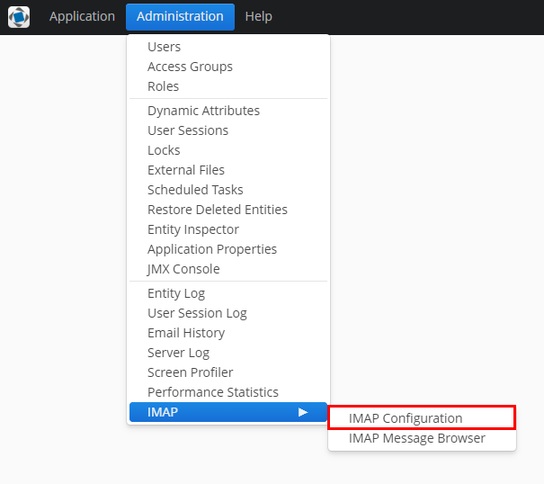
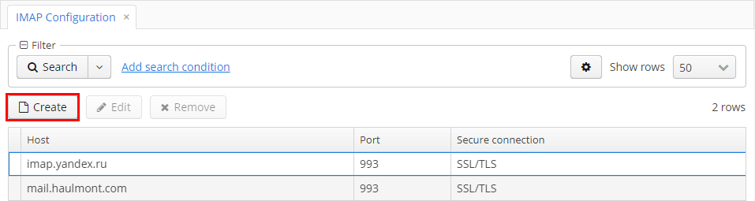
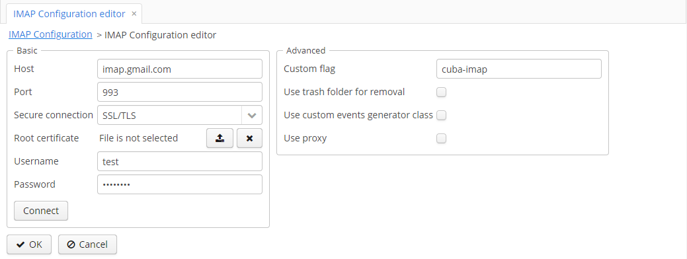
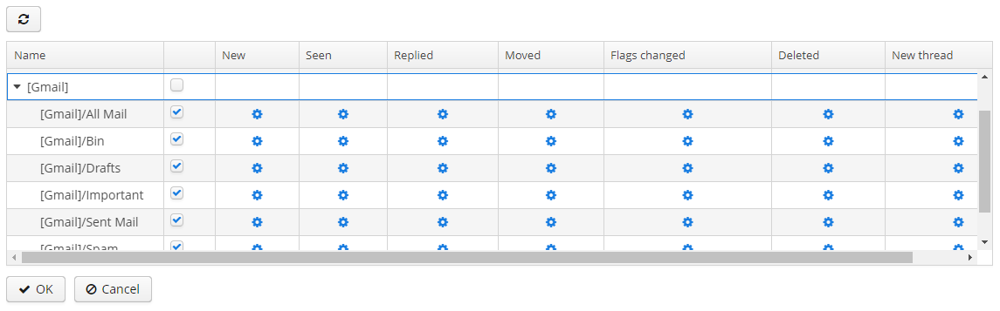
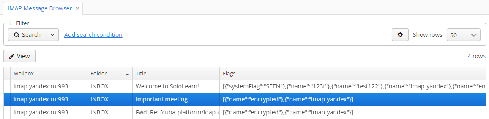

[](http://www.apache.org/licenses/LICENSE-2.0)

**Please note that the component is still in development and not stable.**

# Table of Contents

# Overview

The IMAP-addon provides a readily available instrument for integrating email messaging into any CUBA-based application via the IMAP protocol. The main model of the component is designed to interact with incoming emails via Spring application events.

The component includes the following set of functionalities:
* Integration between any IMAP servers and CUBA applications.
* Basic API methods to work with the main email server functionalities:
    * Connecting to servers;
    * Retrieving and viewing emails;
    * Searching for emails;
    * Operating custom flags.
* Predefined events for implementing custom business logic and processing various updates.
* User interface for configuring IMAP connection settings and events.

# Getting Started

## Installation
To add the IMAP-addon to your project, the following steps should be taken:

1. Open your application in CUBA Studio.

2. Edit Project properties.

3. Click the plus button in the *App components* section of the *Main* tab.

    

4. Specify the coordinates of the component in the corresponding field as follows: **group:name:version**. Click *OK* 
to confirm the operation.

    

    * Artifact group: *com.haulmont.addon.imap*
    * Artifact name: *imap-global*
    * Version: *addon version*
    
    When specifying the component version, you should select the one, which is compatible with the platform version 
    used in your project. Currently, the latest version is 

    | Platform Version | Addon Version  |
    | ---------------- | -------------- |
    | 6.8.x            | 0.1-SNAPSHOT   |

5. Before using the component as a part of your application, it is vital to configure the following application 
properties in the `app.properties` file of your project.

```
imap.encryption.key = HBXv3Q70IlmBMiW4EMyPHw==
imap.encryption.iv = DYOKud/GWV5boeGvmR/ttg==
```

# Component Functionalities

## IMAP Configuration

*IMAP Configuration Browser* is designed to add and manage mailboxes from which emails are retrieved. The browser is 
available from Menu: Administration → IMAP → IMAP Configuration.



Creating a new configuration is available by clicking the *Create* button. 



### IMAP Configuration Editor

*IMAP Configuration Editor* comprises two main sections to fill in: *Basic* and *Advanced*. All required fields are
highlighted in red.



#### Basic

The *Basic* section enables to configure the main attributes for connecting to an email server via IMAP. The description of
all fields is provided below.

* *Host*: specify a host name or IP address of an email server.
* *Port*: provide a port number to connect to an email server. The default value is *143*.
* *Secure Connection*: select an option for secure connection if required. Available values: *STARTTLS*, *SSL/TLS*.
* *Root Certificate*: upload a client certificate if required.
* *Username*: provide a username to connect to an email server.
* *Password*: provide a user password to connect to an email server.

The *Basic* section comprises the *Connect* button. After providing all required information, use the button to upload
a list of folders from the email server to work with.

#### Advanced

The *Advanced* section provides a set of additional options for connecting to an email server.

* *Custom Flag*: specify a custom flag 
* *Use trash folder to remove emails*: 
* *Use custom event generator class*: // to do 
* *Use proxy*: if checked, proxy settings become available (see the description below).

##### *Proxy Configuration*

* *Proxy Host*: provide a host name or IP address of a proxy server.
* *Proxy Port*: provide a port to connect to a proxy server.
* *Use web proxy*: // to do

#### Table of Folders

Once connection to the provided email server is successfully established, the table of folders becomes available.



The table shows a list of folders from the email server you are connected to. In order to enable/disable some folders,
use the checkboxes in the second column. If some folder is disabled, then messages from it are not retrieved.

For each folder you can select a set of IMAP events by using the *Events* table and register custom logic for them 
(for more details, please refer to []()).

## IMAP Message Browser

All emails from connected mailboxes are displayed in IMAP Message Browser (available from Menu: Administration → IMAP → 
IMAP Message Browser).



Selecting an email and clicking *View* opens it for reading. Email Screen contains all general details of an email:
date, author, subject, etc., and two tabs: *Body* and *Attachments*. 

On the *Body* tab, the whole text of an email is displayed.

The *Attachments* tab comprises the table of attachments and the button to download required elements.

# Usage

### Register EventListeners to interact with IMAP events
In order to react to IMAP events in your application, you can register `@Component` methods as Event listener through the `@EventListener` Annotation. 

```
import org.springframework.context.event.EventListener;

@Service(EmailReceiveService.NAME)
public class EmailReceiveServiceBean implements EmailReceiveService {

    @EventListener
    @Override
    public void receiveEmail(NewEmailImapEvent event) {
      // handle IMAP event
    }
}
```

or you can create `@Component` with method having only one parameter with correct event type
```
public class EmailReceiver {
    String NAME = "ceuia_EmailReceiver";

    public void receiveEmail(NewEmailImapEvent event) {
        // handle IMAP event
    }
}
```

Once this is done, the method (in this case `receiveEmail` has to be registered on a particular Folder for a given IMAP connection. This has to be done at runtime via the IMAP configuration UI.

After that the method will get invoked every time when an event occurs.

#### Event types

All events contain `ImapMessage` object that can be used to determine where an event occurs (mail box, folder, message)

The application component allows the following kind of IMAP events:

* `NewEmailImapEvent` is triggered for folder having event with type `ImapEventType.NEW_EMAIL` enabled 
when new message arrives to the folder on IMAP server
* `EmailSeenImapEvent` is triggered for folder having event with type `ImapEventType.EMAIL_SEEN` enabled 
when message is marked with IMAP flag `javax.mail.Flags.Flag.SEEN` 
* `EmailAnsweredImapEvent` is triggered for folder having event with type `ImapEventType.NEW_ANSWER` enabled 
when message is replied (usually it happens through marking message with IMAP flag `javax.mail.Flags.Flag.ANSWERED`)
* `EmailFlagChangedImapEvent` is triggered for folder having event with type `ImapEventType.FLAGS_UPDATED` enabled 
when message gets any IMAP flag changed, including both standard and custom flags. 
Event contains `Map` holding changed flags accompanied with actual state (set or unset)
* `EmailDeletedImapEvent` is triggered for folder having event with type `ImapEventType.EMAIL_DELETED` enabled 
when message is completely deleted from folder on IMAP server, it is **not** related to IMAP flag `javax.mail.Flags.Flag.DELETED`. 
Such events are also triggered when message is moved to trash folder on server in case `ImapMailBox` was configured with trash folder in place 
* `EmailMovedImapEvent` is triggered for folder having event with type `ImapEventType.EMAIL_MOVED` enabled 
when message is moved to other folder on IMAP server. 
**NOTICE**: standard implementation tracks only folders which are selected in `ImapMailBox` configuration not counting trash folder if such was configured
* `NewThreadImapEvent` is not implemented yet

### Using API

Component provides following API to interact with IMAP server:

* `ImapAPI` having methods:
    * `Collection<ImapFolderDto> fetchFolders(ImapMailBox)` - allows to retrieve all folders preserving tree structure. 
    * `Collection<ImapFolderDto> fetchFolders(ImapMailBox, String...)` - allows to retrieve folders with specified names. 
    Result does not preserve tree structure
    * `List<ImapFolderDto> fetchMessage(ImapMessage)` - allows to fetch single message using reference
    * `List<ImapMessageDto> fetchMessages(List<ImapMessage>)` - allows to fetch multiple messages using references.
    Supports fetching from multiple folders and mail boxes
    * `void moveMessage(ImapMessage, String)` - allows to move message to different folder on IMAP server
    * `void deleteMessage(ImapMessage)` - allows to completely delete message from the folder
    * `void setFlag(ImapMessage, ImapFlag, boolean)` - allows to change specified flag of the message, flag can be set or unset
* `ImapAttachmentsAPI` having methods:
    * `Collection<ImapMessageAttachment> fetchAttachments(ImapMessage)` - allows to retrieve attachments of the message. 
    Result contains only meta data, no content
    * `InputStream openStream(ImapMessageAttachment)` and `byte[] loadFile(ImapMessageAttachment` - allow to retrieve content of the message attachment