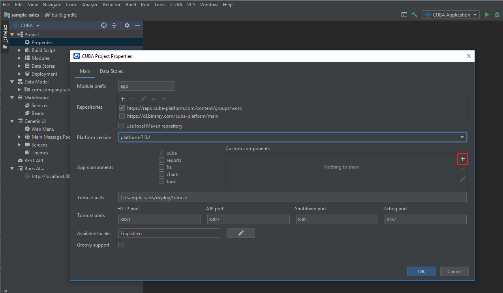
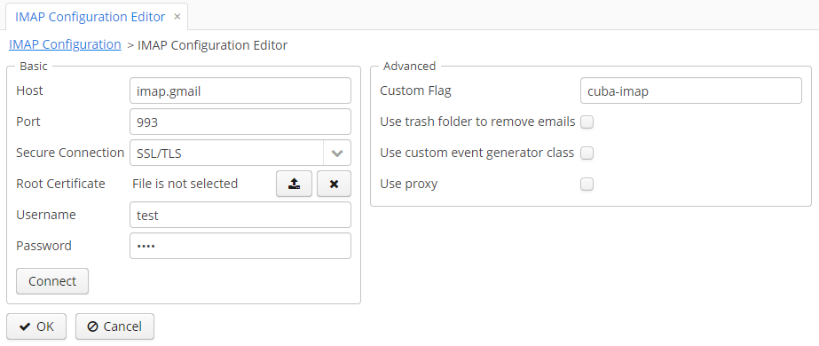

[](http://www.apache.org/licenses/LICENSE-2.0)

**Please note that the component is still in development and not stable.**

# Table of Contents

- [Overview](#overview)
- [Getting Started](#getting-started)
    - [Installation](#installation)
- [Component Functionalities](#component-functionalities)
- [Configuration](#configuration)

# Overview

The IMAP-addon provides a readily available instrument for integrating email messaging into any CUBA-based application 
via the IMAP protocol. The main model of the component is designed to interact with incoming emails via Spring application events.

The component includes the following set of functionalities:
* Integration between any IMAP servers and CUBA applications.
* Basic API methods to work with the main email server functionalities:
    * Connecting to servers;
    * Retrieving and viewing emails;
    * Searching for emails;
    * Operating custom flags.
* Predefined events for implementing custom business logic and processing various updates.
* User interface for configuring IMAP connection settings and events.

# Getting Started

## Installation
To add the IMAP-addon to your project, the following steps should be taken:

1. Open your application in CUBA Studio.

2. Edit Project properties.

3. Click the plus button in the *App components* section of the *Main* tab.

    

4. Specify the coordinates of the component in the corresponding field as follows: **group:name:version**. Click *OK* 
to confirm the operation.

    

    * Artifact group: *com.haulmont.addon.imap*
    * Artifact name: *imap-global*
    * Version: *addon version*
    
    When specifying the component version, you should select the one, which is compatible with the platform version 
    used in your project. Currently, the latest version is 

    | Platform Version | Addon Version  |
    | ---------------- | -------------- |
    | 6.8.x            | 0.1-SNAPSHOT   |

5. Before using the component as a part of your application, it is vital to configure the following application 
properties in the `app.properties` file of your project.

```
imap.encryption.key = HBXv3Q70IlmBMiW4EMyPHw==
imap.encryption.iv = DYOKud/GWV5boeGvmR/ttg==
```

# Component Functionalities

## IMAP Configuration

*IMAP Configuration Browser* is designed to add and manage mailboxes from which emails are retrieved. The browser is 
available from Menu: Administration → IMAP → IMAP Configuration.


Creating a new configuration is available by clicking the *Create* button. 


### IMAP Configuration Editor

*IMAP Configuration Editor* comprises two main sections to fill in: *Basic* and *Advanced*. All required fields are
highlighted in red.



#### Basic

The *Basic* section enables to configure the main attributes for connecting to an email server via IMAP. The description of
all fields is provided below.

* *Host*: specify a host name or IP address of an email server.
* *Port*: provide a port number to connect to an email server. The default value is *143*.
* *Secure Connection*: select an option for secure connection if required. Available values: *STARTTLS*, *SSL/TLS*.
* *Root Certificate*: upload a client certificate if required.
* *Username*: provide a username to connect to an email server.
* *Password*: provide a user password to connect to an email server.

The *Basic* section comprises the *Connect* button. After providing all required information, use the button to upload
a list of folders from the email server to work with.

#### Advanced

The *Advanced* section provides a set of additional options for connecting to an email server.

* *Custom Flag*: specify a custom flag 
* *Use trash folder to remove emails*: 
* *Use custom event generator class*: // to do 
* *Use proxy*: if checked, proxy settings become available (see the description below).

##### *Proxy Configuration*

* *Proxy Host*: provide a host name or IP address of a proxy server.
* *Proxy Port*: provide a port to connect to a proxy server.
* *Use web proxy*: // to do

#### Table of Folders

Once connection to the provided email server is successfully established, the table of folders becomes available.


The table shows a list of folders from the email server you are connected to. In order to enable/disable some folders,
use the checkboxes in the second column. If some folder is disabled, then messages from it are not retrieved.

For each folder you can select a set of IMAP events by using the *Events* table and register custom logic for them 
(for more details, please refer to [Configuration](#configuration)).

## IMAP Message Browser

All emails from connected mailboxes are displayed in IMAP Message Browser (available from Menu: Administration → IMAP → 
IMAP Message Browser).


Selecting an email and clicking *View* opens it for reading. Email Screen contains all general details of an email:
date, author, subject, etc., and two tabs: *Body* and *Attachments*. 

On the *Body* tab, the whole text of an email is displayed.

The *Attachments* tab comprises the table of attachments and the button to download required elements.


# Configuration

## Registering EventListeners to Interact with IMAP Events

In order to make your application react to IMAP events, you can register the `@Component` methods as Event listeners by using
the `@EventListener` annotation. The example of how to set up an event listener is provided below.

```
import org.springframework.context.event.EventListener;

@Service(EmailReceiveService.NAME)
public class EmailReceiveServiceBean implements EmailReceiveService {

    @EventListener
    @Override
    public void receiveEmail(NewEmailImapEvent event) {
      // handles IMAP event
    }
}
```

Another option is to create `@Component` with a method having the required event type as the only parameter.
```
public class EmailReceiver {
    String NAME = "ceuia_EmailReceiver";

    public void receiveEmail(NewEmailImapEvent event) {
        // handle IMAP event
    }
}
```

Once it is done, the selected method (in the example, it is `receiveEmail`) should be registered on a particular folder 
for a given IMAP connection. This should be done at runtime using the IMAP configuration UI (see [Creating Handlers for
IMAP Events]). 
After that, the method will be invoked every time, when the configured event occurs.

## Creating Handlers for IMAP Events

After registering EventListeners, it is required to create handlers for IMAP events related to a particular folder and 
mailbox (for more information see [IMAP Connection](#imap-configuration)). The table of folders comprises several columns,
each representing a certain event type (e.g. New, Seen, Replied, etc.). Clicking gear icons opens IMAP Folder Event Editor.


There you can specify required beans and methods for them.

### Event types

All events contain the `ImapMessage` object that can be used to determine where an event occurs (mailbox, folder, message).

The application component supports the following kinds of IMAP events:

* `NewEmailImapEvent` is triggered for a folder having an event of the `ImapEventType.NEW_EMAIL` type enabled,
when a new message appears in the folder on the IMAP server.
* `EmailSeenImapEvent` is triggered for a folder having an event of the `ImapEventType.EMAIL_SEEN` type enabled,
when a message is marked with the `javax.mail.Flags.Flag.SEEN` IMAP flag.
* `EmailAnsweredImapEvent` is triggered for a folder having an event of the `ImapEventType.NEW_ANSWER` type enabled,
when a message is replied (usually it happens when a message is marked with the `javax.mail.Flags.Flag.ANSWERED` IMAP flag).
* `EmailFlagChangedImapEvent` is triggered for a folder having an event of the `ImapEventType.FLAGS_UPDATED` type enabled,
when a standard or custom IMAP flag is changed for a message.
The event contains a `Map` of all changed flags and their actual state (set or unset).
* `EmailDeletedImapEvent` is triggered for a folder having an event of the `ImapEventType.EMAIL_DELETED` type enabled,
when a message is completely deleted from a folder on the IMAP server side, it is **not** related to the IMAP flag `javax.mail.Flags.Flag.DELETED`. 
Such events are also triggered when a message is moved to a trash folder (if it is configured for a mailbox) on the server.
* `EmailMovedImapEvent` is triggered for a folder having an event of the `ImapEventType.EMAIL_MOVED` type enabled,
when a message is moved to another folder on the IMAP server. 
**Note**: the standard implementation tracks only folders which are selected in the `ImapMailBox` configuration,
but does not count a trash folder, if one is configured.
* `NewThreadImapEvent` is not implemented yet.

## Using API

The component provides the following API to interact with the IMAP server:

* `ImapAPI` methods:
    * `Collection<ImapFolderDto> fetchFolders(ImapMailBox)` — retrieves all folders preserving the tree structure. 
    * `Collection<ImapFolderDto> fetchFolders(ImapMailBox, String...)` — retrieves folders with the specified names. 
    The result is not structured as a tree.
    * `List<ImapFolderDto> fetchMessage(ImapMessage)` — fetches a single message using a reference.
    * `void moveMessage(ImapMessage, String)` — moves a message to a different folder on the IMAP server side.
    * `void deleteMessage(ImapMessage)` — deletes a message from a folder.
    * `void setFlag(ImapMessage, ImapFlag, boolean)` — sets or unsets a specified flag for a message.
* `ImapAttachmentsAPI` methods:
    * `Collection<ImapMessageAttachment> fetchAttachments(ImapMessage)` — retrieves attachments included in a message. 
    The result contains only meta data, no content.
    * `InputStream openStream(ImapMessageAttachment)` and `byte[] loadFile(ImapMessageAttachment` — retrieve the content of a message attachment.